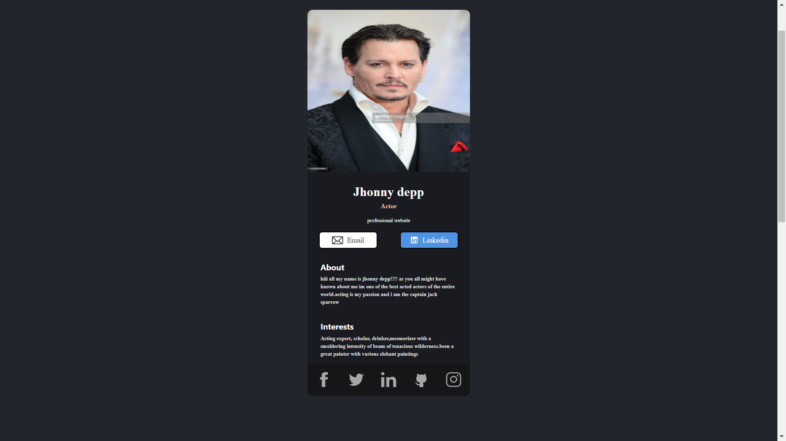

# personal portfolio
1.this project shows us the details of a person in a subtle way,whereas the design and its components are worth using and creating.
## Goal of the project
2.The porftfolio website is created using [`React`](https://reactjs.org/) framework.
This project consists of various basic commands of the react framework.

>This project is part of learning react in [*Scrimba*](https://scrimba.com/allcourses) which was taught by *bob ziroll*

2.this project shows us the details of a person in a subtle way,whereas the design and its components are worth using and creating.

## Structure
i have completed this website by creating four components namely 
* header
 * About
 * Interests
 * Footer

i added all theese components by using React components and rendered them together.

## Stylesheet
for styling i have used general css. for the container of all the above components i have used `CSS-GRID`.where i have contemplately used the grid templates function of both *rows* and *columns* .

## Challenges
1.combining the components without altering the css code was seemingly difficult as the design was changing everytime i added an component.!took more time while doing this...

## working picture of the project

> Above picture shows the live image of the working portfolio website of the project.  

